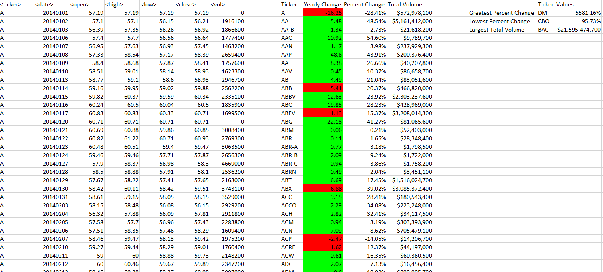
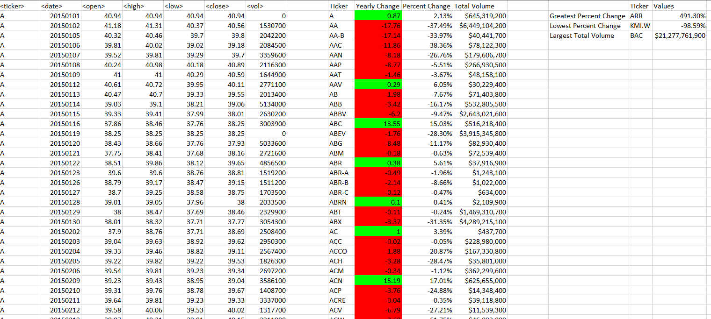
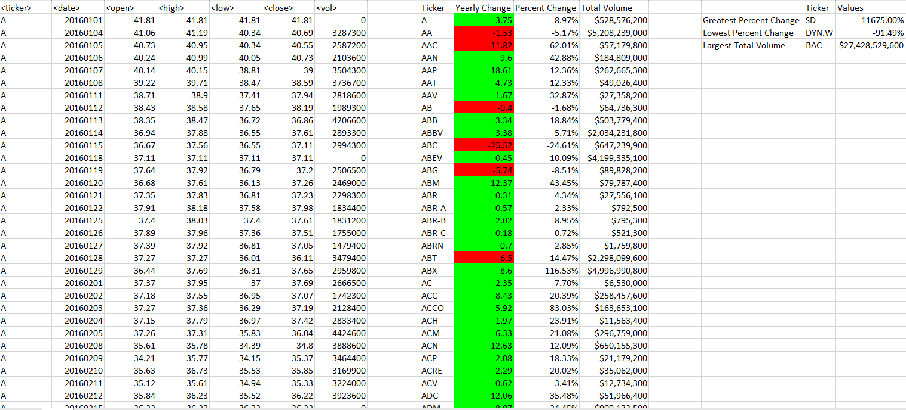

# Stock Market Analysis
Create a script using Excel VBA to analyze mock stock market data. Complete analysis with a summary table added to the file.

# Test Data

Within the resource folder contains the test data set used to create the VBA script.
The columns within the excel file are in order. The Ticker Symbol, The Open Date, The High point, The Low point, the Closed date, and the Stock Volume

Another excel file is added for the first iteration of the script. A .txt file is added as well to demonstrate earlier ideas.

The goal is to create a script using Excel VBA to analyse Stock Market data.

# Submission
Within the submission folder, contains the final iteration of the script along with screenshots of the script being run on an excel file containing mock stock information over 3 years.

* With the given excel file, the script creates a summary table with the following:
  * The ticker symbol
  * The yearly change
  * The percent change
  * Total stock volume

* It also includes additional superlative information for the 3 years
  * Greatest Percent Change
  * Lowest Percent Change
  * Largest Total Stock Volume

The script is also created to run over multiple excel worksheets in a workbook.

The script is written on a .txt file

Below are the screen shots for the analysis.

The 2014 Stock Analysis

The 2015 Stock Analysis

The 2016 Stock Analysis

